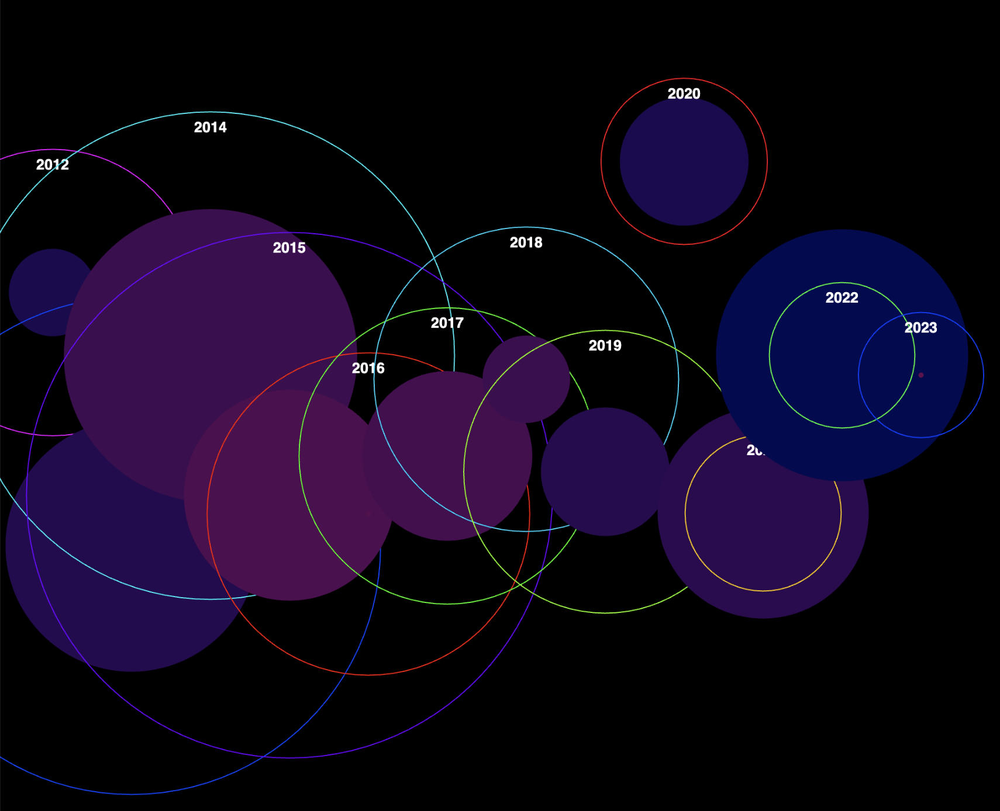

For this week's assignment, I choose the Motor Vehicle Collisions, as I'm interested in how death and crash changes across the year, especially I am now working on that in anthor class from my major. I really appreciate the circle that visualize the wine price last class, so I want to do the same.

I like the neo color, so I use the HSL colormode to achieve this, and I also add some interactive function, that the circle of crash will change with the mouse moves.

